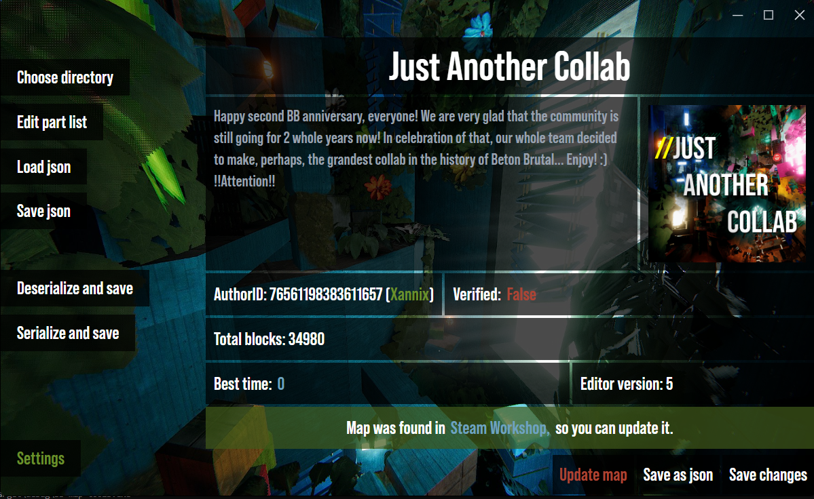
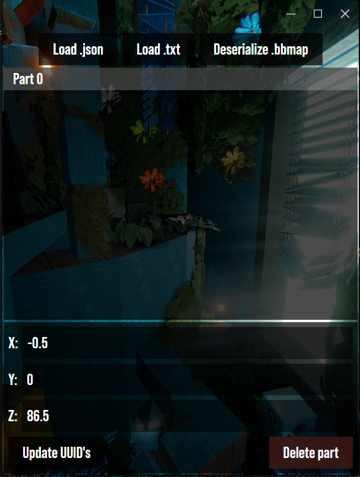

# BETON BRUTAL Map Tools
A simple tool for managing custom maps in [BETON BRUTAL](https://store.steampowered.com/app/2330500). 
 
Current features:
* Deserializing and serializing .bbmap format
* Exporting map data into .json
* Changing metadata like name, description, thumbnail and etc.
* Merging maps each other
* Uploading and updating maps in the Steam Workshop
* *And maybe outher features in the future* ¯\_(ツ)_/¯
 

---
# Some screenshots

BETON BRUTAL [Discord server](https://discord.gg/NmumRuU3d6)
